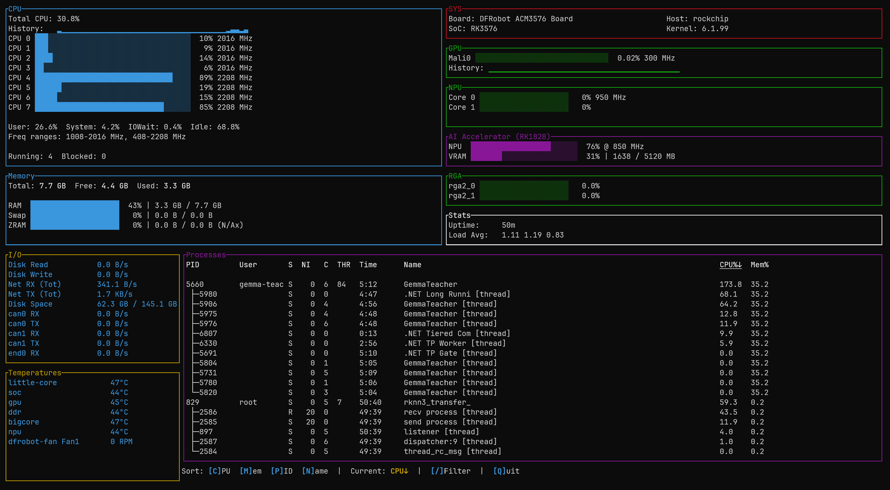
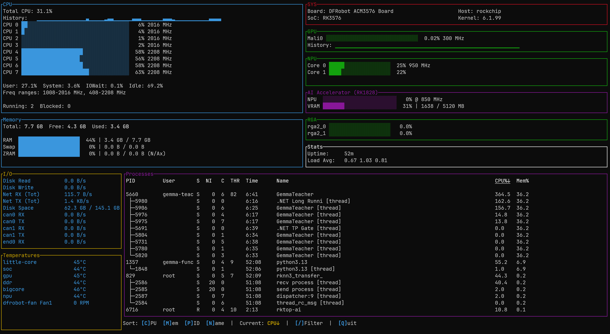

# rktop-ai — Rockchip System & AI Accelerator Monitor

A high-performance system monitoring tool for Rockchip SoC devices (RK3576, RK3588, RK3399) and dedicated PCIe AI accelerator cards (RK1828, RK1820, RM1828MC0-F), written in Rust using the Ratatui TUI framework.


*Live telemetry on DFRobot ACM3576 board with PCIe RK1828 AI accelerator active (76% load @ 850 MHz, 1638 / 5120 MB VRAM).*


*Live telemetry showing host RK3576 dual-core RKNPU2 active (Core 0: 25%, Core 1: 22% @ 950 MHz).*

### Extended Capabilities:
- **Host SoC Telemetry**: Real-time per-core CPU, Mali GPU, onboard RKNPU2, memory, RGA, and thermal sensors across RK3576/RK3588/RK3399 platforms.
- **Dedicated AI Coprocessors**: Real-time NPU utilization, dedicated DDR/VRAM usage, coprocessor CPU load, frequency, operating temperature, and power for Rockchip PCIe accelerator cards via `rknn-smi`.
- **Process & System Stats**: Interactive process sorting, system load averages, network I/O, and disk telemetry with <0.5% CPU overhead.

---

## Features

### Hardware Monitoring
- **CPU**: Per-core usage, frequencies, and time breakdown (user/system/iowait/idle)
- **GPU (Mali)**: Utilization percentage and frequency via Panthor or Bifrost devfreq/debugfs
- **Host NPU (RKNPU2)**: Per-core load (0–2 cores on RK3576, 0–3 cores on RK3588) and dynamic frequency
- **Host DDR / DMC (Dynamic Memory Controller)**: Current frequency, active governor, available frequencies, and governors via devfreq
- **PCIe AI Accelerator (RK1828 / RM1828MC0-F)**:
  - Real-time NPU utilization percentage, clock frequency, and sparkline history
  - Dedicated onboard VRAM gauge (e.g. `1638 MB / 5120 MB` LPDDR)
  - Coprocessor CPU load and operating frequency
  - Work and Prefill modes (`PERFORMANCE`, `NORMAL`, `EFFICIENT`)
  - Dedicated DDR clock rate (`400 MHz`)
  - Available NPU frequency steps (`400, 500, 850 MHz`) and CPU frequency steps (`950–1310 MHz`)
  - Board temperature, power consumption (mW), PCIe bus ID (`0000:01:00.0`), and card health
- **RGA**: 2D graphics accelerator scheduler load across all RGA cores
- **Memory**: RAM, Swap, and ZRAM usage with compression ratio and breakdown
- **Temperatures**: Thermal sensors for CPU, GPU, NPU, and ambient zones
- **Network & Disk I/O**: Real-time throughput rates per network adapter and storage device

### Process & Thread Affinity Profiling
- **Interactive Sorting**: Sort by CPU, Memory, PID, or Name (ascending/descending)
- **Detailed Metrics**: PID, User, Nice level, CPU core affinity, Runtime, CPU%, Memory%
- **Named Process Tracking (`--proc`)**: Inspect specific AI engines (e.g. `rkllm3-server`, `python -m functiongemma_rkllm`) with thread-to-core affinity distribution across Little Cortex-A53 cores (0–3) vs Big Cortex-A72 cores (4–7)
- **Thread Deduplication via TGID**: Groups secondary worker threads cleanly under the main process PID while exposing per-thread core placement
- **Dynamic Display**: Adaptive layout fitting any terminal dimensions

### System Statistics & Version Probing
- System uptime, hostname, kernel release, and load average (1/5/15 min)
- CPU and DDR governors and frequency ranges (per cluster)
- Context switches, interrupts, and softirqs per second
- Active TCP connection count
- NPU and RGA kernel driver versions
- Dynamic detection of Host RKNN and RKLLM runtime library versions (`/proc/*/maps`, `LD_LIBRARY_PATH`, filesystem)
- Dedicated AI Accelerator model and PCIe bus address

---

## Performance

Engineered for zero interference with edge AI workloads and zero thermal penalties:
- **<0.5% CPU Overhead**: Zero busy-loops; events synchronised with terminal ticks.
- **Cached File Descriptors (`src/file_cache.rs`)**: Retains open handles for sysfs and procfs nodes, avoiding repetitive `open()` / `close()` kernel context switches.
- **Streaming Telemetry Daemon (`src/accelerator.rs`)**: Spawns `/bin/rknn-smi info -w` once in a long-lived background thread instead of spawning expensive processes repeatedly.
- **Kernel-Guaranteed Process Safety**: Uses Unix `libc::prctl(PR_SET_PDEATHSIG, SIGTERM)` and explicit PID management to ensure child processes are never orphaned or left as zombies.
- **Dynamic Devfreq Path Scanning**: Discovers SoC frequency and load nodes once at startup with `OnceLock` caching.

---

## Installation

### Prerequisites
- Rockchip SoC device (RK3576, RK3588, RK3399, etc.)
- Linux with sysfs and debugfs mounted
- Rust toolchain (or prebuilt cross-compiled binary)

### Building from Source

```bash
# Clone the repository
git clone https://github.com/ajokela/rktop.git
cd rktop-ai

# Build optimized release binary
cargo build --release

# Binary will be at target/release/rktop-ai
```

### Cross-Compiling for aarch64 (Linux / WSL2)

Cross-compilation from Ubuntu / WSL2 targeting 64-bit ARM. For maximum compatibility across various embedded Linux distributions (avoiding `GLIBC_xxx not found` errors), building a statically linked musl binary is recommended:

```bash
# Add targets
rustup target add aarch64-unknown-linux-musl
rustup target add aarch64-unknown-linux-gnu

# Recommended: Statically linked binary (zero dynamic libc dependencies)
cargo build --target aarch64-unknown-linux-musl --release
aarch64-linux-gnu-strip target/aarch64-unknown-linux-musl/release/rktop-ai

# Or dynamically linked binary:
cargo build --target aarch64-unknown-linux-gnu --release
aarch64-linux-gnu-strip target/aarch64-unknown-linux-gnu/release/rktop-ai
```

### System-Wide Installation

```bash
# Copy to system path
sudo cp target/release/rktop-ai /usr/local/bin/
sudo chmod +x /usr/local/bin/rktop-ai
```

---

## Usage

### Interactive TUI Mode

```bash
# Run with root privileges (required for debugfs access)
sudo rktop-ai
```

### Keyboard Controls

| Key | Action |
|:---:|:---|
| `q`, `Q`, `Esc` | Quit application |
| `c` | Toggle CPU sort (ascending / descending) |
| `m` | Toggle Memory sort (ascending / descending) |
| `p` | Toggle PID sort (ascending / descending) |
| `n` | Toggle Name sort (ascending / descending) |

### CLI Options & Non-Interactive Snapshot Modes

`rktop-ai` provides non-interactive output modes designed for **agentic AI workflows** (e.g. Claude Code or autonomous daemons running directly on the board), telemetry pipelines, and script automation:

| Option | Short | Description |
|:---|:---:|:---|
| `--json` | `-j` | Output a complete structured JSON telemetry snapshot to stdout and exit |
| `--oneshot` | `-1` | Print a clean, formatted ASCII text summary to stdout and exit |
| `--stream [MS]` | `-s` | Continuously stream NDJSON snapshots at sub-second intervals with drift-compensated monotonic timing and `timestamp_unix_ms` (default: 500ms, e.g. `-s 200`) |
| `--watch [SECS]` | `-w` | Continuously stream NDJSON snapshots at second intervals (e.g. `-w 1`) |
| `--proc <names>` | `-p` | Filter & profile named processes, full command lines, and thread CPU core placement (comma-separated, e.g. `-p rkllm,proxy,functiongemma`) |
| `--help` | `-h` | Display usage instructions and CLI options |
| `--version` | `-v` | Display version information |

---

## Agentic AI Workflow Integration

When running AI coding assistants (such as **Claude Code**) or autonomous agents directly on Rockchip embedded platforms, TUI interfaces cannot be easily consumed. `rktop-ai` provides structured telemetry snapshots and continuous NDJSON streaming so agents can inspect hardware utilization, detect thermal throttling, verify model offloading, and profile thread core placement in real time:

```bash
# Full system telemetry in JSON format
sudo rktop-ai --json | jq .

# Inspect dedicated PCIe AI Accelerator metrics
sudo rktop-ai --json | jq .accelerator
# Output:
# {
#   "device_id": 0,
#   "chip_name": "RK1828",
#   "bus_id": "0000:01:00.0",
#   "temp_celsius": 45,
#   "power_mw": null,
#   "cpu_load_pct": 0,
#   "cpu_freq_mhz": 1000,
#   "npu_load_pct": 0,
#   "npu_freq_mhz": 850,
#   "memory_used_mb": 1638,
#   "memory_total_mb": 5120,
#   "health": "OK",
#   "work_mode": "PERFORMANCE",
#   "prefill_mode": "PERFORMANCE",
#   "ddr_freq_mhz": 400,
#   "available_npu_freqs_mhz": [400, 500, 850],
#   "available_cpu_freqs_mhz": [950, 1000, 1100, 1200, 1300, 1310]
# }

# Inspect Host DDR (DMC) frequency and active governor
sudo rktop-ai --json | jq .dmc
# Output:
# {
#   "freq_mhz": 534,
#   "governor": "dmc_ondemand",
#   "available_frequencies_mhz": [534, 1320, 1968, 2736],
#   "available_governors": ["dmc_ondemand", "userspace", "powersave", "performance"]
# }

# Profile specific AI processes and inspect thread affinity on Big vs Little cores
sudo rktop-ai --json --proc rkllm3-server,functiongemma | jq '.tracked_processes[] | {name, cpu_pct, rss_mb, thread_count, little_cores_count, big_cores_count}'

# Sub-second continuous streaming (NDJSON) with millisecond timestamps to resolve rapid LLM prefill phases (e.g. every 200ms)
sudo rktop-ai --stream 200 --proc rkllm3-server | jq -c '{time_ms: .timestamp_unix_ms, dmc: .dmc.freq_mhz, rkllm_cpu: .tracked_processes[0].cpu_pct, npu: .accelerator.npu_load_pct}'

# Human-readable one-shot diagnostic print
sudo rktop-ai --oneshot
```

> [!NOTE]
> In continuous streaming mode (`--stream`), the first snapshot acts as the baseline for CPU delta counters (reporting `cpu_pct: 0` for processes on the initial tick), while all subsequent snapshots compute real-time delta utilization. Secondary threads sharing a thread group leader are automatically deduplicated into `threads` array with individual core placement.

### Running Without Root (Optional)

You can grant specific capabilities to run without `sudo`:

```bash
sudo setcap cap_dac_read_search,cap_sys_ptrace=eip /usr/local/bin/rktop-ai
rktop-ai
```

---

## Display Panels

### CPU Panel
- Per-core usage bars with real-time frequency
- CPU time breakdown (User, System, IOWait, Idle percentages)
- Cluster frequency ranges (big.LITTLE)
- Process state counts, context switches, interrupts, and softirqs

### Memory Panel
- RAM usage (used + cached / total)
- Swap and ZRAM usage with real-time compression ratio

### GPU Panel (if available)
- Mali GPU utilization percentage and clock frequency (Panthor / Bifrost)

### Host NPU Panel (if available)
- Per-core onboard RKNPU2 load and frequency

### AI Accelerator Panel (if PCIe card detected)
- Dedicated NPU load bar with clock frequency
- Dedicated VRAM gauge (e.g. `1599 / 5120 MB`)
- Coprocessor CPU utilization and frequency
- Card temperature, PCIe bus ID, power draw, and health status
- Historical sparkline activity graph

### System Info Panel
- Board name, SoC model, hostname, kernel release, and CPU architecture
- NPU driver, RGA driver, RKNN runtime, and RKLLM runtime versions
- AI Card model (`RK1828`) and PCIe bus address (`0000:01:00.0`)

---

## Architecture

### Multi-Module Design

- **`src/main.rs`** — Ratatui TUI rendering, event loop, double-buffered terminal layouts, and state management.
- **`src/snapshot.rs`** — Non-interactive JSON (`--json`) and one-shot ASCII (`--oneshot`) telemetry generation for agentic workflows and scripts.
- **`src/accelerator.rs`** — PCIe AI accelerator monitor, async stream parser, zero-orphan process lifecycle management.
- **`src/hardware.rs`** — Dynamic devfreq scanning, Rockchip SoC probing, RKNPU2, GPU, and RGA telemetry.
- **`src/file_cache.rs`** — Open file descriptor pool eliminating repetitive `open()` / `close()` syscalls.
- **`src/sysinfo_ext.rs`** — Extended system metrics (per-process stats, ZRAM, TCP connections).

---

## Supported Hardware

| Hardware | Support Details |
|:---|:---|
| **Rockchip RK3576** | Octa-core ARM (4x A72 + 4x A53), Mali-G52 MC3 (`27800000.gpu`), dual-core RKNPU2 (`27700000.npu`). Tested on DFRobot ACM3576. |
| **Rockchip RK3588 / RK3588S** | Octa-core ARM (4x A76 + 4x A55), Mali-G610 MC4 (`fb000000.gpu`), triple-core RKNPU2 (`fdab0000.npu`). Tested on Orange Pi 5 Max. |
| **Rockchip RK3399** | Hexa-core ARM (2x A72 + 4x A53), Mali-T860 MP4. |
| **RM1828MC0-F PCIe AI Card** | Dedicated RK1828 NPU chip, 5120 MB LPDDR VRAM, PCIe endpoint `/dev/pcie-rkep*`, vendor `/bin/rknn-smi` interface. |

---

## License

This project is licensed under the BSD 3-Clause License - see the [LICENSE](LICENSE) file for details.
